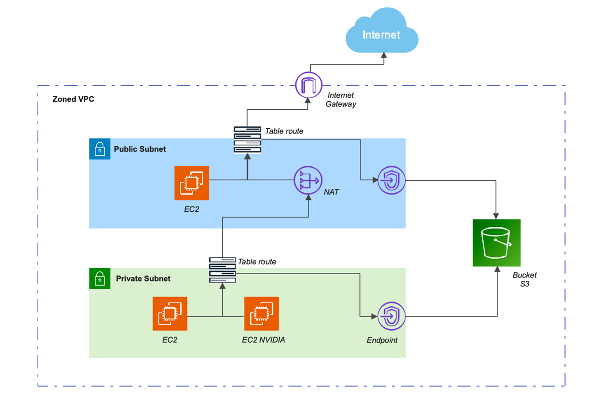
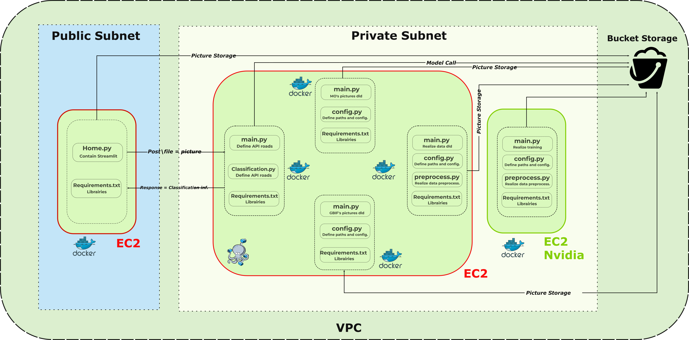
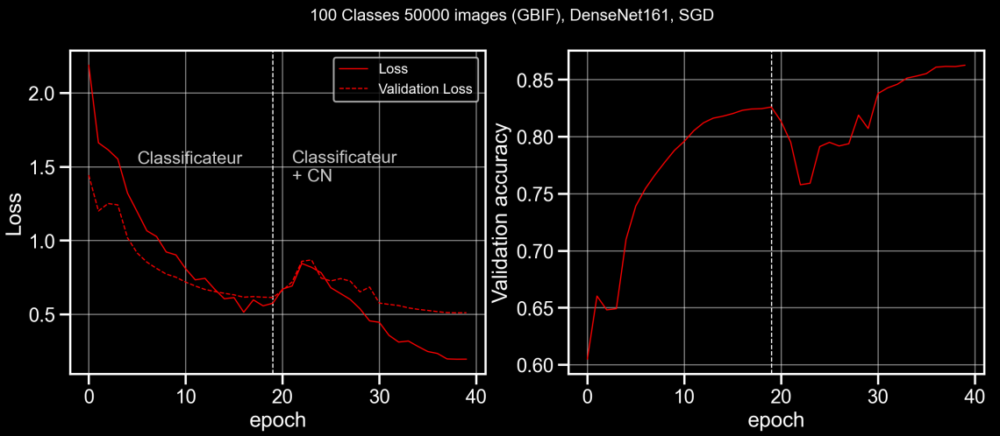
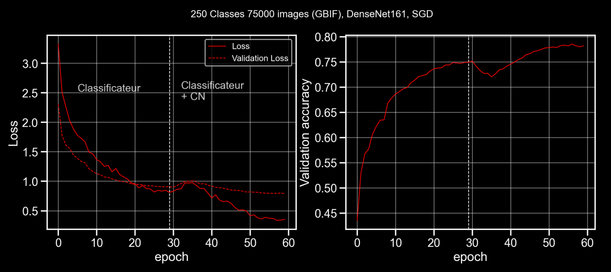
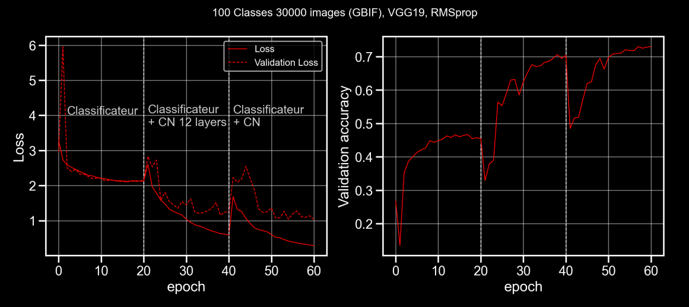

# Mushroom_recognition
CNN  project for Mushroom recognition (Keras - FastAI - Docker)
The project and the app is detailed on the folowing streamlit : http://15.188.106.69:8501/

# Project's presentation

These project aims to develop an application to provide Mushroom recognition.
These project is based on two axis : 
- The DataScience part :
    - A CNN Keras (VGG19, VGG16, Xception, Densenet)
    - A CNN FastAI (Densenet161)

The DS part propose CNN architecture optimisation, parameters determination, and interpretability analysis (GradCam, GuidedBackPropagation)

- The Data Engineering part
    - Docker files for Frontend (Streamlit + API calls)
    - Docker files for backtend (FAST API + CNN prediction)

The current application is deployed on AWS (public and private subnets) according to the following architecture :

## AWS architecture : 

AWS architecture : 

## Micro-service and API :

Objectives : 

Currently deployed : 

## Models accuracy

Densenet - 100 labels : 

Densenet - 250 labels :

VGG19 - 100 labels : 

# Project utilization

For people who desire to use our work, please be careful about the folders and path.
- In DS parts, each files has it's own path. Be sur to use yours
- In DE parts, a private bucket is used to store the data and models used by the frontend and backend. Be sur to do the same or to go on a local solution

# Contacts 

Please feel free to mail us or contact us for additional information :

Joffrey Lemery :
- joffrey.lemery.jl@gmail.com
- 

Thomas Louvradoux :
- louvradouxthomas@msn.com
-     

Julien Le Bot :
- lebot.julien@gmail.com
-      

Gaetan Wendling:
- gaetan@fwendling.org
-      

