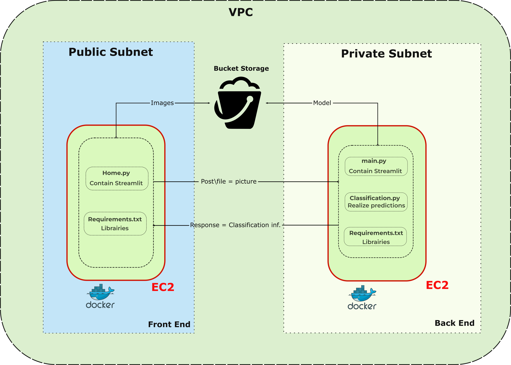
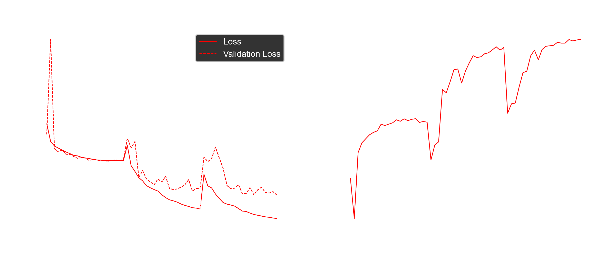

# Mushroom_recognition
CNN  project for Mushroom recognition (Keras - FastAI - Docker)

# Project's presentation

These project aims to develop an application to provide Mushroom recognition.
These project is based on two axis : 
- The DataScience part :
    - A CNN Keras (VGG19, VGG16, Xception, Densenet)
    - A CNN FastAI (Densenet161)
- The Data Engineering part
    - Docker files for Frontend (Streamlit + API calls)
    - Docker files for backtend (FAST API + CNN prediction)

The current application is deployed on AWS (public and private subnets) according to the following architecture :

## AWS architecture : 

AWS architecture : 

## Micro-service and API :

Objectives : 

 
Currently deployed : 

# Models accuracy : 

Densenet - 100 labels :

Densenet - 250 labels :

VGG19 - 100 labels :

